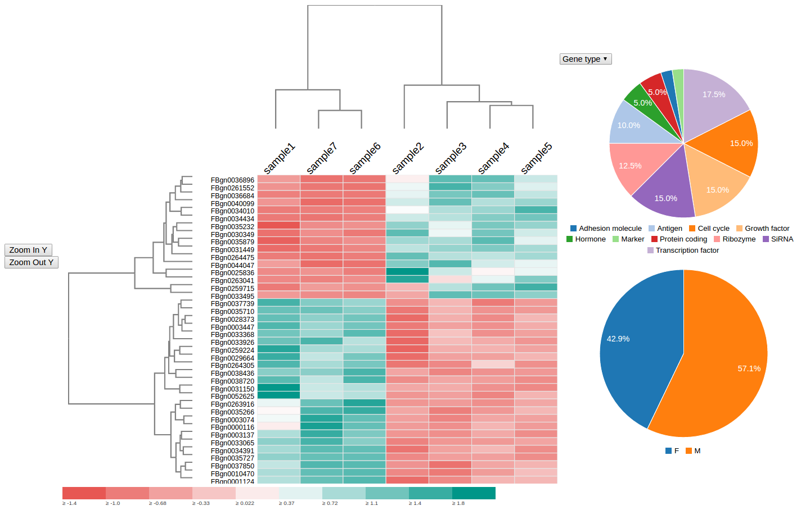

# spot-my-gene [](https://circleci.com/gh/nicgirault/spot-my-gene)
A d3 librairy to display differential gene expression analysis and find the gene of your dreams!



The demo is [here](https://nicgirault.github.io/spot-my-gene)

### Installation

```shell
bower install --save spot-my-gene
```

### API

This section is not ready yet. For now, please refer to the src-demo folder and demo folders to understand how to use this librairy.

### Contribution

```shell
npm install
npm test
```
